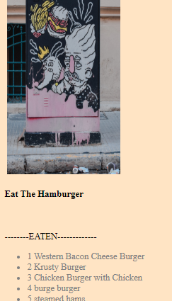

# hamburg

In Progress Readme...

How Too..

To get this Application to run you will need to create a keys.js file with you mysql login info in the config folder.
You will then need to use the schema and seed to create DB and tables for handlesbars to pull from. 

Then you must "node server" to run the server.js and start your page.

Navigate to localhost:8080 and you will see everything up and running. 
